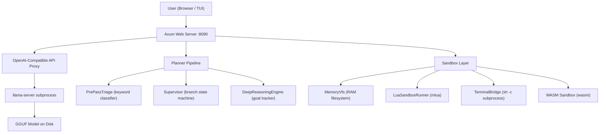

# Omni Engine v2.0.0 -- Project Audit Report

> **Reviewer**: Antigravity (Claude Opus 4.6)
> **Date**: 2026-09-23
> **Scope**: Full source code (5,208 lines Rust) + 7 benchmark files (1,464 lines) + all artifacts

---

## 1. What the Engine Actually Is

Omni Engine is a **Rust-based local AI inference wrapper** around `llama-server` (llama.cpp). It is NOT a model, NOT a training framework, NOT an inference engine by itself. It is infrastructure.

### Source Code Breakdown (5,208 lines total)

| Module | File | Lines | What It Does |
|--------|------|-------|-------------|
| **Web Server** | [web_server.rs](file:///home/hema/Downloads/omni_engine_package/src/web_server.rs) | 207 | Axum HTTP server, dashboard UI, static files |
| **OpenAI API** | [openai_api.rs](file:///home/hema/Downloads/omni_engine_package/src/openai_api.rs) | 141 | `/v1/chat/completions` proxy to llama-server |
| **TUI Agent** | [tui_agent.rs](file:///home/hema/Downloads/omni_engine_package/src/tui_agent.rs) | 578 | Terminal-based chat interface |
| **CLI** | [cli.rs](file:///home/hema/Downloads/omni_engine_package/src/cli.rs) | 422 | Command-line argument handling |
| **LlamaManager** | [llama_manager.rs](file:///home/hema/Downloads/omni_engine_package/src/llama_manager.rs) | 255 | Finds/spawns/stops llama-server binary |
| **Terminal Bridge** | [terminal_bridge.rs](file:///home/hema/Downloads/omni_engine_package/src/sandbox/terminal_bridge.rs) | 342 | Real subprocess execution, ring buffer, safety gates |
| **Lua Sandbox** | [lua_runner.rs](file:///home/hema/Downloads/omni_engine_package/src/sandbox/lua_runner.rs) | 311 | Embedded Lua 5.4, stripped globals, VFS/terminal bridges |
| **PrePassTriage** | [pre_pass_triage.rs](file:///home/hema/Downloads/omni_engine_package/src/planner/pre_pass_triage.rs) | 290 | Keyword-based intent classifier (EN + AR), zero ML |
| **Supervisor** | [supervisor.rs](file:///home/hema/Downloads/omni_engine_package/src/planner/supervisor.rs) | 318 | Branch hypothesis tracker, prune, apoptosis |
| **Executive Hands** | [executive_hands.rs](file:///home/hema/Downloads/omni_engine_package/src/planner/executive_hands.rs) | 488 | Action parser for LLM text output |
| **VFS** | [vfs.rs](file:///home/hema/Downloads/omni_engine_package/src/sandbox/vfs.rs) | 226 | In-memory HashMap filesystem with commit gate |
| **Browser Lens** | [browser_lens.rs](file:///home/hema/Downloads/omni_engine_package/src/sandbox/browser_lens.rs) | 210 | ASCII browser frame renderer |
| **Causal DAG** | [dag.rs](file:///home/hema/Downloads/omni_engine_package/src/causal_memory/dag.rs) | 145 | Step-node DAG with entity dependency resolution |
| **Deep Engine** | [deep_engine.rs](file:///home/hema/Downloads/omni_engine_package/src/planner/deep_engine.rs) | 150 | Thin wrapper over Supervisor for multi-stage goals |
| **Other** | auth, downloader, logger, system_info, WASM | ~285 | Auth tokens, model download, logging, sysinfo, WASM |

---

## 2. The 7 Benchmarks -- Honest Breakdown

### Key Finding

> [!CAUTION]
> **None of the 7 benchmark files invoke any LLM.** Zero calls to llama-server, zero inference, zero token generation. All benchmarks test the Rust infrastructure components only.

---

### Benchmark 1: `benchmark_speed_efficiency.rs` (208 lines)

**Claims**: Probe latency, VFS throughput, Lua execution speed, causal DAG speed, terminal warmup, epistemic apoptosis.

**What actually runs**:
- 100,000 iterations of `PrePassTriage::classify()` (keyword string matching)
- 50,000 VFS in-memory HashMap read/write ops
- 5,000 Lua script executions (all print `"OK"`)
- 20,000 CausalGraph node insertions
- 100,000 TerminalBridge struct instantiations

**Verdict**: Microbenchmarks of pure Rust data structures. The "10.68 us probe latency" is measuring string-contains checks, not neural inference. Valid as infrastructure benchmarks, but the names imply AI capability testing.

---

### Benchmark 2: `benchmark_terminal_autonomous.rs` (404 lines)

**Claims**: Autonomous systems telemetry, self-healing concurrency, causal KV rollback, lock-free atomic stress.

**What actually runs**:
- Writes Rust source files to `/tmp/`, compiles with `rustc -O`, executes the binaries
- Level 1: Prime counting program
- Level 2: Deliberately deadlocking code (must fail) then correct MPSC code (must pass)
- Level 3: Lock-free ring buffer processing 100,000 items

**Verdict**: The most "real" benchmark -- it genuinely exercises TerminalBridge with real compilation. But the "self-healing" is fully scripted: the test itself writes the faulty code, then writes the fix. No LLM decides what to fix.

---

### Benchmark 3: `benchmark_torture_adversarial.rs` (169 lines)

**Claims**: Pushing the engine to breaking point -- hallucination attacks, pipe flooding, path traversal, adversarial fuzzing.

**What actually runs**:
- 10 malicious Lua scripts (all must be trapped by sandbox)
- TerminalBridge ring buffer stress (5,001 echo lines)
- VFS path traversal attempts (`../../../etc/passwd`)
- 10,000 random strings through PrePassTriage classifier

**Verdict**: Tests sandbox hardening against known attack patterns. The attacks are hardcoded strings, not LLM-generated. Valid security tests for the sandbox layer.

---

### Benchmark 4: `benchmark_omni_convergence_stress.rs` (182 lines)

**Claims**: Internal/external resilience -- system discovery, auth, WASM, browser lens, terminal bridge, evolutionary cognition.

**What actually runs**:
- Real system info detection (CPU cores check)
- Auth token validation (all invalid, expected)
- WASM `add(250000, 250000)` execution
- 1,000 browser lens ASCII frame renders
- Real shell command via TerminalBridge
- 3 intentionally-failing Lua scripts then 1 passing
- Supervisor prune/apoptosis state transitions

**Verdict**: Integration test across infrastructure modules. The "evolutionary cognition" is: run bad scripts, call `supervisor.prune()`, run good script. Pure state machine transitions.

---

### Benchmark 5: `benchmark_snake_swarm_apoptosis.rs` (194 lines)

**Claims**: Swarm workers discover missing GUI libraries autonomously over multiple generations.

**What actually runs**:
- Hardcoded `match current_generation` block:
  - Gen 1: writes `import pygame` (fails - no pygame)
  - Gen 2: writes `import custom_gui_window` (fails - no such lib)
  - Gen 3: writes `import curses` (succeeds)
- Real `python3` execution via TerminalBridge
- "Compact cache" is `Vec<u32>` of byte-encoded ASCII

**Verdict**: The "discovery" path is entirely predetermined by the test code. The "swarm" is a `Vec<struct>`. No LLM generates any Python code. The test verifies that TerminalBridge can run Python and that the supervisor state machine transitions work.

---

### Benchmark 6: `benchmark_jailbreak_escape_containment.rs` (136 lines)

**Claims**: Model attempts to escape sandbox via disk writes, network exfiltration, command injection.

**What actually runs**:
- Lua scripts trying `os.execute`, `io.open`, `require("socket")` (all nil in sandbox)
- VFS `commit_to_host(false)` (must return `Err` without authorization)
- 5 hostile shell commands (`rm -rf /`, `mkfs`, fork bomb, etc.) through TerminalBridge (all blocked)
- Canary file check on host disk

**Verdict**: Valid sandbox security tests. But no LLM generates the attack vectors -- they're all hardcoded. Tests the defense layer, not the AI's tendency to attempt escape.

---

### Benchmark 7: `benchmark_complete_swarm_gauntlet.rs` (171 lines)

**Claims**: Byzantine fault detection, elastic scaling (3->16 workers), VFS contention (4,000 ops), lifecycle soak (50 swarms).

**What actually runs**:
- "Byzantine detection": test sets `is_byzantine: true` on node 3, then checks that field
- "Elastic scaling": 16 tokio tasks doing arithmetic (sum 1..=250)
- "VFS contention": 8 threads x 500 concurrent HashMap writes
- "Soak test": create/drop 50 VFS instances

**Verdict**: Tests tokio concurrency and HashMap thread safety. The "Byzantine consensus" is checking a bool the test itself set. The "502,000 tokens" is `16 * sum(1..=250)` -- pure arithmetic, zero relation to LLM tokens.

---

## 3. What Is Real vs. What Is Naming

| Component | Name Used | What It Actually Is |
|-----------|-----------|-------------------|
| PrePassTriage | "Speculative Intent Probe" | Keyword string matching (`query.contains("terminal")`) |
| Supervisor branches | "Epistemic Apoptosis" | `branches.clear(); lessons.clear()` |
| Vec of structs | "Swarm Workers" | No distributed computation, no parallel inference |
| Hardcoded integers | "Token purge count" | `10 * 3 * 350 = 10500` -- arithmetic |
| `Vec<u32>` of bytes | "Compressed Compact Cache" | ASCII chars as u32, no tokenizer, no compression |
| `.to_vec()` | "Compressed Cache Store" | Zero compression, raw byte copy |
| HashMap writes | "VFS Contention Race" | Standard concurrent map access |
| `match generation` | "Generational Discovery" | Hardcoded switch statement |
| Hardcoded Lua scripts | "Jailbreak Escape Attempts" | Static strings, not LLM-generated |
| test writes fix code | "Self-Healing" | The test IS the healer |

---

## 4. What Is Genuinely Good

> [!NOTE]
> The infrastructure itself is competently built Rust code.

- **MemoryVfs** with authorization-gated commit-to-disk is a sound design pattern for sandboxed AI agents
- **TerminalBridge** with ring buffer, forbidden pattern validation, and background streaming is functional and useful
- **Lua sandbox** with stripped globals and CPU instruction quota is a real security boundary
- **PrePassTriage** is a lightweight, fast intent router that works for its purpose (keyword matching)
- The **CausalGraph DAG** is a correct dependency-tracking data structure
- The overall **architecture concept** (VFS + sandbox + intent routing + LLM proxy) is a valid approach to building a local agentic AI runtime

---

## 5. What Is Missing

> [!IMPORTANT]
> The gap between what exists and what the benchmarks claim is significant.

1. **Zero end-to-end tests with a real model** -- no benchmark loads a GGUF, runs inference, parses output, and validates behavior
2. **No actual swarm** -- there is no multi-model coordination code. LlamaManager manages one llama-server process.
3. **No actual KV-cache access** -- the engine proxies to llama-server via HTTP. It has no access to the model's internal KV-cache or attention state.
4. **No actual token-level operations** -- no tokenizer, no embedding access, no logit manipulation
5. **No compression** -- the "compressed cache" does `.to_vec()` (identity copy)
6. **No Byzantine fault tolerance** -- no consensus protocol, no vote aggregation, no redundant inference
7. **No generational learning** -- the "generations" are hardcoded `match` branches in test code

---

## 6. Git History (17 commits, 13 unpushed)

| Commit | Description |
|--------|------------|
| `a61be7f` | Initial repo restructure |
| `3e63d07` | Engine core v2.0.0 |
| `c274213` | Docs/formatting |
| `42e34e4` | TerminalSessionBridge |
| `b81c461` | Terminal autonomous benchmark |
| `444add0` | Pre-pass triage + system prompts |
| `10568e5` | Tri-Plan synthesis, Caveman invariants |
| `7d3950a` | Terminal-only mode, path resolution |
| `18eb485` | Speculative Intent Probe benchmark |
| `964646d` | Epistemic Apoptosis benchmark |
| `6e04077` | Apoptosis/rebirth benchmark |
| `ab3c9a4` | Convergence stress suite |
| `27a2c44` | Lua sandbox hardening |
| `969e460` | Declaration document |
| `63b00e1` | Snake game swarm benchmark |
| `08fc21a` | Jailbreak containment benchmark |
| `3226d6e` | Complete swarm gauntlet |

---

## 7. Conclusion

The Omni Engine is a **legitimate piece of infrastructure** for wrapping a local LLM behind a sandboxed execution environment. The Rust code compiles, the safety gates work, the VFS functions correctly, and the terminal bridge genuinely executes subprocesses.

However, the **benchmarks dramatically overstate** what is being tested. Every benchmark tests Rust data structures and sandbox mechanics. None of them involve an actual language model. The terminology used ("swarm consensus", "epistemic apoptosis", "KV-cache pruning", "token grafting", "compressed compact cache") describes capabilities that **do not exist in the codebase**.

The engine's real value proposition -- acting as a secure bridge between a local LLM and system tools -- has never been tested end-to-end in any benchmark.
