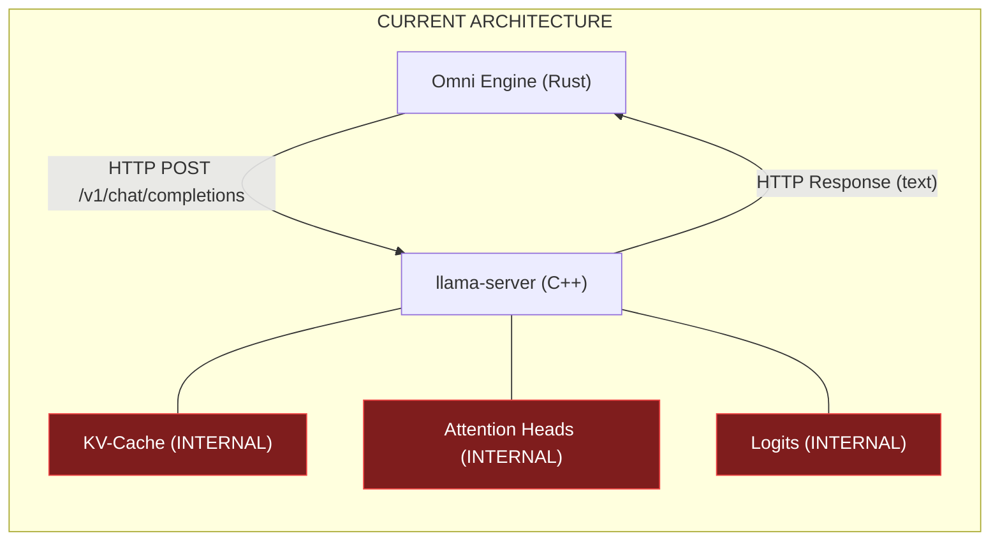
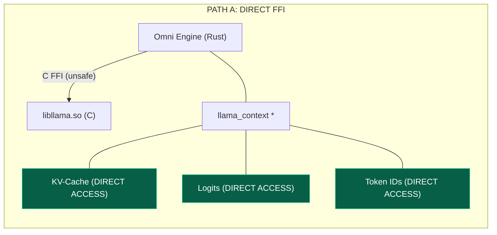
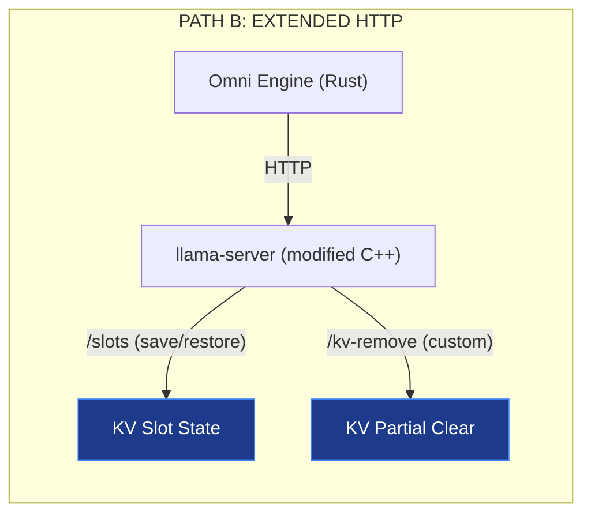

# KV-Cache Theories -- Can the Engine Implement Them?

> **Short Answer**: No, not with the current architecture. The engine talks to the model via HTTP -- it has zero access to the KV-cache.

---

## The Architecture Gap



The engine sends text prompts over HTTP and receives text responses. Everything between (tokenization, embedding, attention computation, KV-cache management, logit sampling) is **completely invisible** to the engine. It's a black box.

The `CausalGraph` and `CompressedCacheStore` in the codebase are Rust data structures that track **metadata about steps** -- they have zero connection to the actual transformer KV-cache inside the model.

---

## What Is a KV-Cache (Technically)?

In a transformer model, every layer has an attention mechanism that computes:

```
Attention(Q, K, V) = softmax(QK^T / sqrt(d_k)) * V
```

The **KV-cache** stores the Key and Value matrices for all previously processed tokens. This avoids recomputing them on every new token. For a model like Qwen 1.5B with 28 layers:

```
KV-cache size = 2 (K+V) * 28 layers * seq_len * head_dim * num_heads * sizeof(float16)
             ~= 2 * 28 * 2048 * 64 * 16 * 2 bytes
             ~= 230 MB for 2048 token context
```

To manipulate this, you need **direct memory access** to these tensors inside the running model.

---

## What llama.cpp's C API Actually Exposes

llama.cpp does have KV-cache manipulation functions in its C API (`llama.h`):

```c
// Remove tokens [p0, p1) from sequence seq_id in KV cache
void llama_kv_cache_seq_rm(struct llama_context * ctx, int seq_id, int p0, int p1);

// Copy sequence from src to dst in KV cache
void llama_kv_cache_seq_cp(struct llama_context * ctx, int seq_src, int seq_dst, int p0, int p1);

// Shift token positions [p0, p1) by delta in KV cache
void llama_kv_cache_seq_shift(struct llama_context * ctx, int seq_id, int p0, int p1, int delta);

// Clear entire KV cache
void llama_kv_cache_clear(struct llama_context * ctx);

// Inspect KV cache occupancy
struct llama_kv_cache_view llama_kv_cache_view_init(struct llama_context * ctx, int n_seq_max);
```

These functions enable:
- Removing specific token ranges from cache (partial rollback)
- Branching conversations (copy one sequence to start a new one)
- Context window sliding (shift positions to free space)
- Full cache clear (start fresh)

**BUT**: These require a `llama_context *` pointer -- direct C-level access to the model in the same process. HTTP API does NOT expose these.

---

## Three Upgrade Paths

### Path A: Direct C FFI Bindings (Full KV Access)

Replace the llama-server subprocess with direct Rust FFI bindings to `llama.h`.



**What this enables:**
- `llama_kv_cache_seq_rm()` -- Real Causal KV Rollback (remove poisoned token ranges)
- `llama_kv_cache_seq_cp()` -- Real Swarm branching (fork a conversation into parallel hypotheses)
- `llama_kv_cache_seq_shift()` -- Real context window management
- Direct logit access for confidence-based apoptosis decisions
- Direct token-level operations (no HTTP serialization overhead)

**Effort**: Major rewrite. 2-4 weeks. Need to:
1. Compile llama.cpp as a static library (`libllama.a`)
2. Write Rust FFI bindings (or use `llama-cpp-2` crate)
3. Replace `LlamaManager` with direct model loading
4. Handle `unsafe` blocks carefully
5. Manage GPU memory (CUDA/Vulkan) from Rust

**Risk**: High. `unsafe` FFI is error-prone. GPU memory management is complex.

**Existing crate**: [`llama-cpp-2`](https://crates.io/crates/llama-cpp-2) provides safe Rust bindings.

---

### Path B: Extended llama-server API (Partial KV Access)

Keep llama-server but use its undocumented `/slots` API + add custom endpoints.



**What this enables:**
- Save/restore entire KV-cache state to disk (slot checkpointing)
- Basic cache clearing between conversations
- Multiple concurrent conversations via slot IDs

**What it does NOT enable:**
- Fine-grained token-range removal
- Branching within a single conversation
- Logit inspection
- Token-level confidence analysis

**Effort**: 1-2 weeks. Moderate complexity.

**Risk**: Low. No `unsafe` code. But limited KV control.

---

### Path C: Python Bridge to llama-cpp-python (Pragmatic)

Use `llama-cpp-python` which already has KV-cache bindings, bridged from Rust via subprocess or FFI.

```python
from llama_cpp import Llama

llm = Llama(model_path="model.gguf", n_ctx=2048)

# Direct KV-cache manipulation
llm._ctx.kv_cache_seq_rm(seq_id=0, p0=100, p1=200)  # Remove tokens 100-200
llm._ctx.kv_cache_seq_cp(src=0, dst=1, p0=0, p1=100)  # Branch conversation
```

**What this enables**: Same as Path A but through Python.

**Effort**: 1 week. Use TerminalBridge to run Python scripts.

**Risk**: Low code risk, but adds Python as a runtime dependency and inter-process communication overhead.

---

## What Each Theory Actually Needs

| Theory | Minimum Requirement | Path A | Path B | Path C |
|--------|---------------------|--------|--------|--------|
| **Causal KV Rollback** (remove bad tokens) | `kv_cache_seq_rm(ctx, seq, p0, p1)` | YES | NO | YES |
| **Epistemic Apoptosis** (kill poisoned branch) | `kv_cache_clear(ctx)` + reload clean state | YES | PARTIAL | YES |
| **Swarm Branching** (fork into parallel hypotheses) | `kv_cache_seq_cp(ctx, src, dst, p0, p1)` | YES | NO | YES |
| **Compressed Cache** (evict cold tokens) | `kv_cache_seq_rm()` + re-summarize | YES | NO | YES |
| **Confidence-Based Pruning** (check token certainty) | Direct logit access after `llama_decode()` | YES | NO | YES |
| **Multi-Model Swarm** (Leader + Workers) | Multiple `llama_context *` in one process | YES | NO | PARTIAL |

---

## Honest Assessment

> [!IMPORTANT]
> The maintenance fixes (Mutex safety, hardcoded paths, etc.) are **prerequisites** -- you need a stable engine before adding complex features. But they don't unlock KV-cache access. That requires an architectural change.

### Recommended sequence:

```
Phase 1: Maintenance fixes (this report)          -- 1 week
Phase 2: Path C (Python bridge, quick KV access)   -- 1 week
Phase 3: Validate KV theories with real model       -- 2 weeks
Phase 4: Path A (native FFI) if theories prove out  -- 3-4 weeks
```

Phase 2 (Python bridge) lets you **test the theories quickly** without rewriting the engine. If the theories work in Python, THEN invest in the native FFI rewrite. If they don't work, you saved 3-4 weeks of wasted effort.

---

## What Would NOT Work Even With Full KV Access

Some claims from the benchmarks describe capabilities that go beyond what KV-cache manipulation can do:

| Claim | Reality |
|-------|---------|
| "Remove specific knowledge from the model" | KV-cache is per-conversation, not persistent. Clearing it doesn't remove knowledge -- it just forgets THIS conversation. The weights still contain the knowledge. |
| "Byzantine fault tolerance across swarm workers" | Requires actual redundant inference + voting. Not a KV-cache operation. |
| "Token grafting from dead to living branch" | KV-cache entries are position-dependent. You can copy ranges but the attention patterns may not transfer meaningfully between different conversation contexts. |
| "Compressed cache store" | Real KV compression (like quantized KV, or H2O attention sink) is a model-level optimization done inside llama.cpp, not from outside. |
